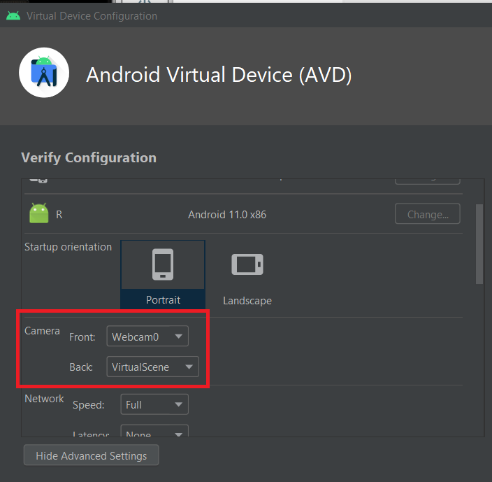
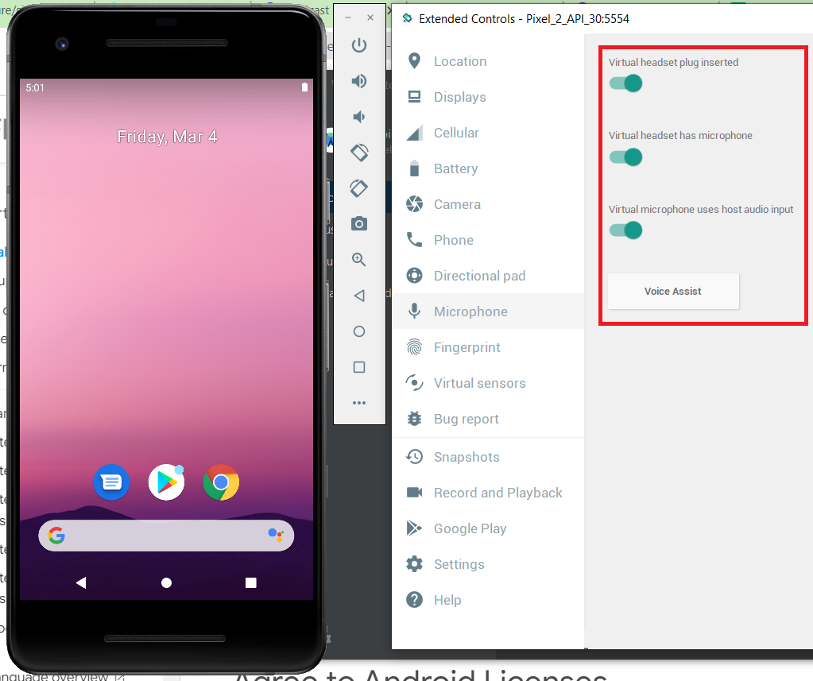
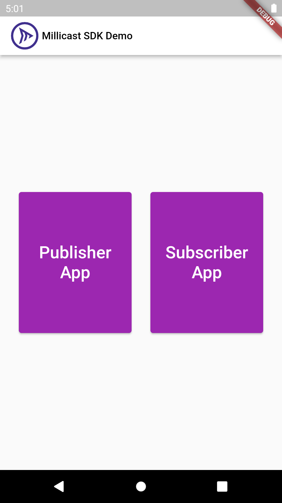
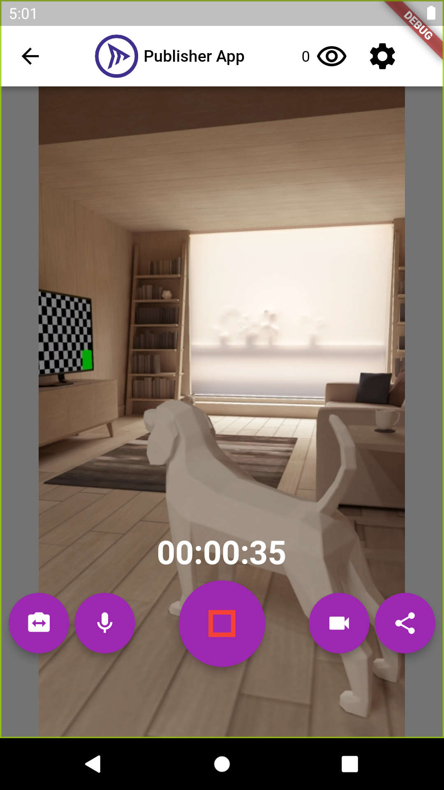
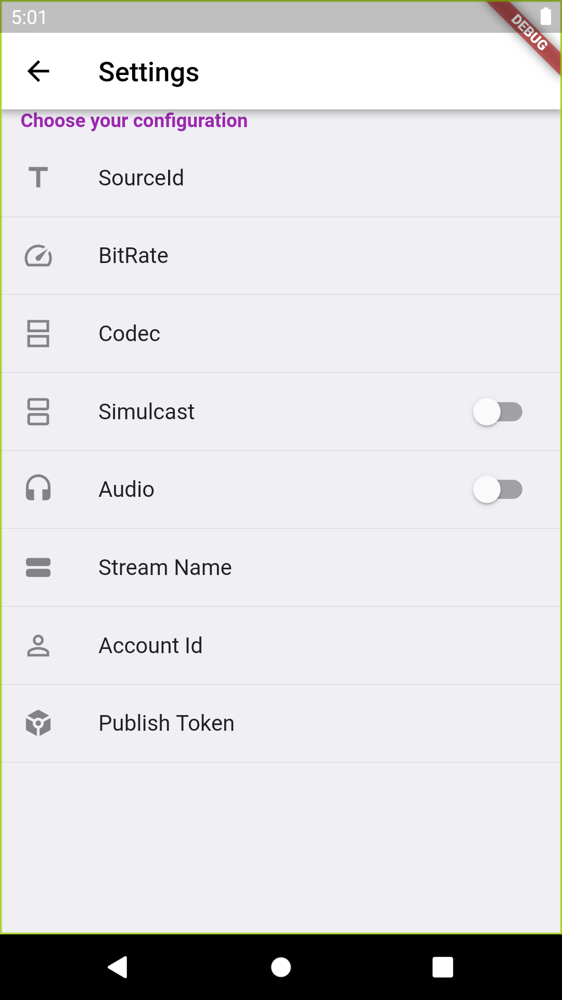
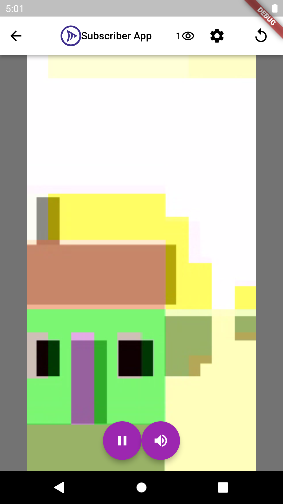
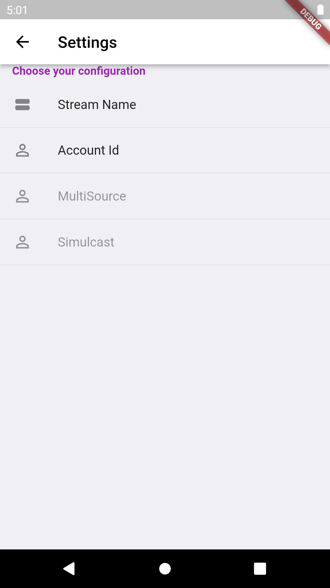

# Example

Millicast Flutter SDK Example

## Table of Contents
* [Getting Started](#getting-started)
* [Setup](#setup)
    + [Connect Real Device](#connect-real-device)
        - [Android](#android)
        - [iOS](#ios)
    + [Setting up Emulator with Android Studio](#setting-up-emulator-with-android-studio)
        - [Windows Emulator Installation Guide](#windows-emulator-installation-guide)
        - [MacOS Emulator Installation Guide](#macos-emulator-installation-guide)
        - [Linux Emulator Installation Guide](#linux-emulator-installation-guide)
    + [Setting Up Camera](#setting-up-camera)
    + [Setting Up Microphone](#setting-up-microphone)
* [Setting up Emulator for iOS](#setting-up-emulator-for-ios)
* [Usage](#usage)
* [Publisher App](#publisher-app)
    + [Publisher Settings](#publisher-settings)
* [Subscriber App](#subscriber-app)
    + [Subscriber Settings](#subscriber-settings)

## Getting Started

This is used for End to End testing of every feature, before creating the pull request.

## Setup

Follow the installation indicated [here](https://docs.flutter.dev/get-started/install).
Assuming that you have successfully run `flutter doctor`, your flutter version is 2.10.x or newer and `dart` version above 2.16.x is installed, install the required dependencies running:

```sh
$ flutter pub get
```

Add a .env file in current path. You can find the following example in `.env.sample` file:

```
MILLICAST_STREAM_NAME=yourStreamName
MILLICAST_ACCOUNT_ID=yourAccountId
MILLICAST_PUBLISH_TOKEN=yourPublishToken
```

> You will need to find or create a new stream name with a token in your Millicast Dashboard. You can do that following this [link](https://docs.dolby.io/streaming-apis/docs/managing-your-tokens).

You need to set up an emulator or connect a device in order to run the app.

### Connect Real Device

#### Android:

```
1) Put you Android device in debug mode following this [tutorial](https://developer.android.com/studio/debug/dev-options).
2) Connect device and using your specific IDE, 
3) Run flutter in the detected device.
```

#### iOS:

```
1) Plug in your iPhone, sign in with your iCloud account in XCode.
2) Change the bundle identifier. 
3) Change the device in your IDE.
4) Run flutter in the detected device.
5)[Optional] Open XCode => Runner => Build Settings => Enable bitcode => No
```
#### Setting Up Emulator with Android Studio

Following the guide indicated above, you should already have your emulator up and running.

#### Windows Emulator Installation Guide

For windows, follow this [link](https://docs.flutter.dev/get-started/install/windows#android-setup), 

#### MacOS Emulator Installation Guide

For iOS, you can get more information on how to set up an emulator [here](https://docs.flutter.dev/get-started/install/macos). 

#### Linux Emulator Installation Guide

You can get more information following this [link](https://docs.flutter.dev/get-started/install/linux).


Be sure to give access to your computer camera and microphone in order to be able to use it for testing, otherwise the emulator will create a sample video simulating the camera usage.

### Setting Up Camera

To give your Android emulator access to your camera, go to Android Studio and edit your desired emulator. 




### Setting Up Microphone

To give your Android emulator access to your microphone, start you emulator and open the emulator options. Then enable `Virtual headset plug inserted` and `Virtual microphone uses host audio input`.



## Setting up Emulator for iOS

If you want to test the Publish feature in iOS you will need an actual Apple device, as the Apple emulator does not allow access to the camera.

## Usage

To test the example app once the .env file is set up, simply run the following command in the `/example` folder:

```
flutter run
```

Once in the app you will be prompted with the home page allowing you to choose between the Publish and View options.



## Publisher App

In the publisher app, you can switch camera, mute/unmute, turn off camera and share the stream with the `share` button. 

This app will also be subscribed to stream events, allowing you to keep the viewer user count.



### Publisher Settings

Publisher settings allow you to set a SoruceId, set maximum bitrate, codec, simulcast and stereo.

You may also change the stream information (name, accountId and publish token).



## Subscriber App



### Subscriber Settings

Subscriber settings allow you to select a multisource SoruceId and different simulcast layers.

You may also change the stream information (Stream name & accountId).


